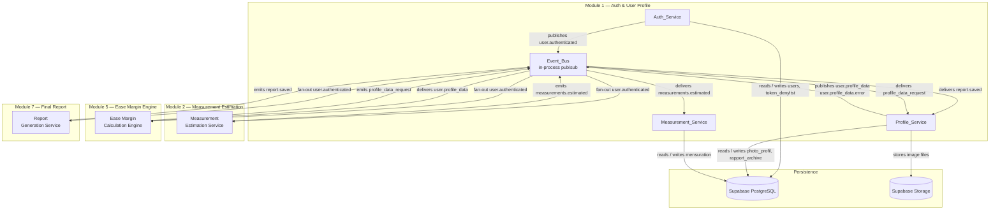

# Design Document — Module 1: Authentication & User Profile

**Feature:** `auth-user-profile`
**Workflow:** Requirements-First
**Stack:** Python 3.11 · FastAPI · PostgreSQL (Supabase) · Supabase Storage · Render.com
**Module path:** `backend/app/modules/auth_catalogues/`

---

## Overview

Module 1 is the identity backbone of the Lova Fashion platform. It owns all user
lifecycle concerns: account creation, credential authentication, JWT-based session
management, role-based access control (RBAC), profile data (name, email, profile
picture history), and longitudinal body measurement storage.

Three sub-systems collaborate inside the module:

| Sub-system | Responsibility |
|---|---|
| **Auth_Service** | Registration, login, logout, JWT issuance and validation, token denylist |
| **Profile_Service** | Profile read/update, profile-picture upload, report archiving, admin operations |
| **Measurement_Service** | Manual measurement creation, event-driven measurement ingestion, history retrieval |

All other modules interact with Module 1 either through the HTTP API (authenticated
requests carrying a JWT) or through the internal Event_Bus. Module 1 never calls
other modules directly; it only publishes and consumes events.

---

## Architecture

### Component Diagram



### Design Decisions

- **In-process Event_Bus for MVP**: Instead of an external broker (Redis Streams,
  SQS), the Event_Bus is implemented as a simple in-process Python publish/subscribe
  registry using `asyncio` queues or FastAPI `BackgroundTasks`. This removes
  infrastructure dependencies for the competition demo while keeping the event
  contracts identical to what a real broker would require. Migrating to an external
  broker later only requires swapping the bus adapter.

- **Shared `auth_catalogues/` folder**: Modules 1, 3, and 4 share the same Python
  package. Each module occupies a sub-package
  (`auth_catalogues/auth/`, `auth_catalogues/profile/`,
  `auth_catalogues/measurement/`) and exposes its own APIRouter, which is mounted
  by the top-level `auth_catalogues/router.py`.

- **Frontend-agnostic API**: All endpoints return JSON. No session cookies, no
  server-side rendering. The frontend (React or Flutter, TBD) consumes the REST API
  and stores the JWT on the client side.

---

## Components and Interfaces

### Internal Package Layout

```
backend/app/modules/auth_catalogues/
├── __init__.py
├── router.py               # mounts auth_router, profile_router, measurement_router
├── auth/
│   ├── __init__.py
│   ├── router.py           # /auth/* endpoints
│   ├── service.py          # Auth_Service logic
│   ├── schemas.py          # Pydantic request/response models
│   ├── security.py         # JWT helpers, bcrypt helpers
│   └── dependencies.py     # get_current_user, require_role
├── profile/
│   ├── __init__.py
│   ├── router.py           # /users/* and /admin/* endpoints
│   ├── service.py          # Profile_Service logic
│   └── schemas.py
├── measurement/
│   ├── __init__.py
│   ├── router.py           # /users/me/mensurations and /users/{cni}/mensurations
│   ├── service.py          # Measurement_Service logic
│   └── schemas.py
└── events/
    ├── __init__.py
    ├── bus.py              # in-process Event_Bus (publish / subscribe / dispatch)
    ├── handlers.py         # consumers: measurements.estimated, report.saved
    └── publishers.py       # producers: user.authenticated, user.profile_data
```

### Key Dependency Interfaces

```python
# dependencies.py — reusable FastAPI dependencies
async def get_current_user(token: str = Depends(oauth2_scheme)) -> UserClaims:
    """Validates JWT, checks denylist, returns CNI + role."""

def require_role(*roles: Role):
    """Factory returning a dependency that enforces role membership."""
```

```python
# bus.py — Event_Bus interface
class EventBus:
    def subscribe(self, event_type: str, handler: Callable) -> None: ...
    async def publish(self, event_type: str, payload: dict) -> None: ...
```

---

## Data Models

### PostgreSQL Table Definitions

All tables live in the `public` schema of the Supabase PostgreSQL instance.
`NOW()` defaults use `timezone('utc', now())` to guarantee UTC storage.

```sql
-- ── Role enum ───────────────────────────────────────────────────────────────
CREATE TYPE user_role AS ENUM ('Client', 'Tailor', 'Admin');

-- ── Users ───────────────────────────────────────────────────────────────────
CREATE TABLE users (
    cni                VARCHAR(9)    PRIMARY KEY
                                     CHECK (cni ~ '^[A-Za-z0-9]{9}$'),
    nom                VARCHAR(100)  NOT NULL,
    email              VARCHAR(255)  NOT NULL UNIQUE,
    mot_de_passe       TEXT          NOT NULL,        -- bcrypt hash only
    role               user_role     NOT NULL,
    is_active          BOOLEAN       NOT NULL DEFAULT TRUE,
    date_inscription   TIMESTAMPTZ   NOT NULL DEFAULT (timezone('utc', now()))
);

CREATE INDEX idx_users_email     ON users (email);
CREATE INDEX idx_users_role      ON users (role);
CREATE INDEX idx_users_is_active ON users (is_active);

-- ── Profile photos ──────────────────────────────────────────────────────────
CREATE TABLE photo_profil (
    id_photo     UUID          PRIMARY KEY DEFAULT gen_random_uuid(),
    cni          VARCHAR(9)    NOT NULL REFERENCES users (cni) ON DELETE CASCADE,
    url_photo    TEXT          NOT NULL,
    date_upload  TIMESTAMPTZ   NOT NULL DEFAULT (timezone('utc', now()))
);

CREATE INDEX idx_photo_profil_cni ON photo_profil (cni);

-- ── Body measurements ────────────────────────────────────────────────────────
CREATE TABLE mensuration (
    id_mesure          UUID          PRIMARY KEY DEFAULT gen_random_uuid(),
    cni                VARCHAR(9)    NOT NULL REFERENCES users (cni) ON DELETE CASCADE,
    tour_poitrine      NUMERIC(6,2)  NOT NULL CHECK (tour_poitrine  > 0 AND tour_poitrine  <= 300),
    tour_taille        NUMERIC(6,2)  NOT NULL CHECK (tour_taille    > 0 AND tour_taille    <= 300),
    tour_hanches       NUMERIC(6,2)  NOT NULL CHECK (tour_hanches   > 0 AND tour_hanches   <= 300),
    longueur_bras      NUMERIC(6,2)  NOT NULL CHECK (longueur_bras  > 0 AND longueur_bras  <= 300),
    hauteur            NUMERIC(6,2)  NOT NULL CHECK (hauteur        > 0 AND hauteur        <= 300),
    date_mensuration   TIMESTAMPTZ   NOT NULL DEFAULT (timezone('utc', now())),
    source_event_hash  TEXT          UNIQUE    -- SHA-256 of (cni||values||source_timestamp)
                                               -- NULL for manual entries; set for event-driven entries
);

CREATE INDEX idx_mensuration_cni       ON mensuration (cni);
CREATE INDEX idx_mensuration_date      ON mensuration (cni, date_mensuration DESC);
CREATE INDEX idx_mensuration_evt_hash  ON mensuration (source_event_hash)
                                        WHERE source_event_hash IS NOT NULL;

-- ── Report archive ───────────────────────────────────────────────────────────
CREATE TABLE rapport_archive (
    id               UUID          PRIMARY KEY DEFAULT gen_random_uuid(),
    cni              VARCHAR(9)    NOT NULL REFERENCES users (cni) ON DELETE CASCADE,
    report_id        TEXT          NOT NULL,
    date_generation  TIMESTAMPTZ   NOT NULL,
    archived_at      TIMESTAMPTZ   NOT NULL DEFAULT (timezone('utc', now())),
    UNIQUE (cni, report_id)                   -- idempotency: one archive row per (user, report)
);

CREATE INDEX idx_rapport_cni ON rapport_archive (cni, archived_at DESC);

-- ── JWT denylist (logout invalidation) ──────────────────────────────────────
CREATE TABLE token_denylist (
    jti         TEXT          PRIMARY KEY,   -- JWT ID claim (UUID)
    expires_at  TIMESTAMPTZ   NOT NULL       -- used by cleanup job to purge expired rows
);

CREATE INDEX idx_token_denylist_expires ON token_denylist (expires_at);

-- ── Tailor ↔ Client assignment (Tailor RBAC) ────────────────────────────────
CREATE TABLE tailor_client_assignment (
    tailor_cni  VARCHAR(9)  NOT NULL REFERENCES users (cni) ON DELETE CASCADE,
    client_cni  VARCHAR(9)  NOT NULL REFERENCES users (cni) ON DELETE CASCADE,
    assigned_at TIMESTAMPTZ NOT NULL DEFAULT (timezone('utc', now())),
    PRIMARY KEY (tailor_cni, client_cni)
);

CREATE INDEX idx_tca_tailor ON tailor_client_assignment (tailor_cni);
CREATE INDEX idx_tca_client ON tailor_client_assignment (client_cni);
```

### Data Model Notes

- `source_event_hash` is `NULL` for manually-entered measurements. For event-driven
  measurements from Module 2, it stores `SHA-256(cni + sorted_measurement_values +
  source_timestamp)`. The `UNIQUE` constraint on this column enforces idempotency
  at the database level (Property 8).
- `token_denylist` should be purged periodically (e.g., a scheduled Render cron job
  or a FastAPI startup task) to remove rows where `expires_at < NOW()`.
- All monetary/measurement values use `NUMERIC(6,2)` (4 digits before decimal,
  2 after) — sufficient for body measurements in centimetres up to 9999.99 cm.

---

## API Endpoints

All endpoints are prefixed under the module router mounted at `/` in `main.py`.
Authentication errors follow a consistent envelope (see Error Handling section).

### Authentication Endpoints (`/auth`)

#### `POST /auth/register`

| Field | Value |
|---|---|
| Auth required | No |
| Request body | `{ "cni": "A12345678", "nom": "Marie Dupont", "email": "marie@example.com", "mot_de_passe": "secret99", "role": "Client" }` |
| Success | `201 Created` — `{ "cni", "nom", "email", "role", "date_inscription" }` |
| Errors | `409` duplicate CNI or email · `422` validation failure (missing field, invalid CNI/email/password/nom/role format) |


#### `POST /auth/login`

| Field | Value |
|---|---|
| Auth required | No |
| Request body | `{ "email": "marie@example.com", "mot_de_passe": "secret99" }` |
| Success | `200 OK` — `{ "access_token": "<JWT>", "token_type": "bearer" }` |
| Errors | `401` invalid credentials or deactivated account · `422` missing field · `429` rate-limit exceeded (5 failures / 15 min) |

Side effect: publishes `user.authenticated` event on success.

#### `POST /auth/logout`

| Field | Value |
|---|---|
| Auth required | Yes (Bearer JWT) |
| Request body | None |
| Success | `200 OK` — `{ "message": "Session terminated." }` |
| Errors | `401` missing token · `401` expired token (not added to denylist) · `200` already-invalidated token (idempotent) |

---

### Profile Endpoints (`/users`)

#### `GET /users/me`

| Field | Value |
|---|---|
| Auth required | Yes — any role |
| Success | `200 OK` — `{ "cni", "nom", "email", "role", "date_inscription" }` |
| Errors | `401` invalid / missing token |

#### `PATCH /users/me`

| Field | Value |
|---|---|
| Auth required | Yes — any role |
| Request body | `{ "nom"?: "...", "email"?: "..." }` (at least one field required) |
| Success | `200 OK` — updated profile fields |
| Errors | `409` email already used · `422` invalid email format, nom > 100 chars, empty body, immutable field included, role field by non-Admin · `403` role change by non-Admin |

#### `POST /users/me/photos`

| Field | Value |
|---|---|
| Auth required | Yes — any role |
| Request body | `multipart/form-data` with `file` field (JPEG / PNG / WebP, max 5 MB) |
| Success | `201 Created` — `{ "id_photo", "url_photo", "date_upload" }` |
| Errors | `413` file > 5 MB · `422` wrong MIME type or empty file · `503` Supabase Storage unavailable |

#### `GET /users/me/photos`

| Field | Value |
|---|---|
| Auth required | Yes — any role |
| Success | `200 OK` — `[ { "id_photo", "url_photo", "date_upload" }, ... ]` ordered by `date_upload DESC`; empty list if no photos |
| Errors | `401` invalid token |

---

### Measurement Endpoints (`/users`)

#### `POST /users/me/mensurations`

| Field | Value |
|---|---|
| Auth required | Yes — `Client` role |
| Request body | `{ "tour_poitrine": 90.5, "tour_taille": 70.0, "tour_hanches": 95.0, "longueur_bras": 60.0, "hauteur": 165.0 }` (all in cm) |
| Success | `201 Created` — `{ "id_mesure", "tour_poitrine", "tour_taille", "tour_hanches", "longueur_bras", "hauteur", "date_mensuration" }` |
| Errors | `422` any value ≤ 0, non-numeric, or > 300 cm |

#### `GET /users/me/mensurations`

| Field | Value |
|---|---|
| Auth required | Yes — `Client` role |
| Success | `200 OK` — list of Mensuration records ordered by `date_mensuration DESC`; empty list if none |
| Errors | `401` · `403` wrong role |

#### `GET /users/{cni}/mensurations`

| Field | Value |
|---|---|
| Auth required | Yes — `Tailor` (for assigned clients) or `Admin` |
| Path param | `cni` — target client's CNI |
| Success | `200 OK` — full Mensuration history for that client |
| Errors | `403` Tailor not assigned to client · `403` Client role attempting this path · `404` CNI not found |

---

### Admin Endpoints (`/admin`)

#### `GET /admin/users`

| Field | Value |
|---|---|
| Auth required | Yes — `Admin` role |
| Success | `200 OK` — `[ { "cni", "nom", "email", "role", "is_active", "date_inscription" }, ... ]` |
| Errors | `401` · `403` non-Admin |

#### `PATCH /admin/users/{cni}/role`

| Field | Value |
|---|---|
| Auth required | Yes — `Admin` role |
| Path param | `cni` — target user's CNI |
| Request body | `{ "role": "Tailor" }` |
| Success | `200 OK` — updated user record |
| Errors | `403` target is Admin · `422` invalid role value · `404` CNI not found |

#### `PATCH /admin/users/{cni}/deactivate`

| Field | Value |
|---|---|
| Auth required | Yes — `Admin` role |
| Path param | `cni` — target user's CNI |
| Success | `200 OK` — `{ "message": "Account deactivated." }` (idempotent) |
| Errors | `403` non-Admin · `404` CNI not found |

---

### Internal Event Handlers and Publishers

#### Event handler: `measurements.estimated` (consumed from Module 2)

- Subscribed by `Measurement_Service` at application startup via `EventBus.subscribe`.
- Validates payload (all 5 measurement fields present, values > 0 and ≤ 300 cm).
- Computes `source_event_hash`; if already present in `mensuration` table, discards silently (idempotency).
- On unknown CNI: logs error, does not create record.

#### Event handler: `report.saved` (consumed from Module 7)

- Subscribed by `Profile_Service`.
- Checks `(cni, report_id)` unique constraint; if duplicate, discards silently.
- Creates a `rapport_archive` row with `archived_at = NOW()`.

#### Event publisher: `user.profile_data` (triggered by Module 5 request)

- Subscribed by `Profile_Service` on event type `profile_data_request`.
- Retrieves latest (or session-selected) Mensuration for the CNI.
- Publishes `user.profile_data` on success or `user.profile_data.error` if no measurements or unknown CNI.

---

## Authentication & Security Design

### JWT Structure

**Algorithm:** HS256 (HMAC-SHA256) with a secret key stored in the `JWT_SECRET` environment variable (minimum 32 bytes of entropy).

**Header:**
```json
{ "alg": "HS256", "typ": "JWT" }
```

**Payload claims:**
```json
{
  "iss": "lova-fashion-auth",
  "sub": "<cni>",
  "cni": "<cni>",
  "role": "Client|Tailor|Admin",
  "iat": 1720000000,
  "exp": 1720086400,
  "jti": "<uuid4>"
}
```

- `iss` is validated on every token check against the hardcoded `"lova-fashion-auth"` issuer.
- `jti` (JWT ID) is a UUID4 stored in `token_denylist` on logout.
- `exp` is always `iat + 86400` (24 hours exactly), as required by Requirement 2.2.
- `sub` duplicates `cni` for standard JWT interoperability.

### Token Validation Flow

```
1. Extract "Authorization: Bearer <token>" header.
2. Decode JWT, verify HS256 signature against JWT_SECRET.
3. Check iss == "lova-fashion-auth".
4. Check required claims: cni, role, exp, jti all present.
5. Check exp > NOW() (reject with 401 "Token expired" if not).
6. Check jti NOT IN token_denylist (reject with 401 "Token invalidated" if found).
7. Inject UserClaims(cni, role) into request state for downstream handlers.
```

### Password Security

- **Algorithm:** bcrypt via `passlib[bcrypt]`.
- **Cost factor:** 12 (balances security and login latency on Render free tier).
- Plaintext password is never logged, stored, or returned anywhere in the request lifecycle.

### Rate Limiting

- **Scope:** Per-email, tracked in an in-memory `dict[email, FailedAttemptRecord]` for MVP.
- **Threshold:** 5 consecutive failed login attempts within a 15-minute sliding window.
- **Response:** `HTTP 429` with `Retry-After` header set to seconds remaining in the window.
- **Reset:** The counter resets to 0 after a successful login for the same email.

> **Upgrade path:** Replace the in-memory dict with a Redis key for multi-worker deployments.

### Bearer Token Extraction

FastAPI `OAuth2PasswordBearer` dependency extracts the token from the `Authorization` header.
If the header is absent or the scheme is not `Bearer`, the dependency raises `HTTP 401` before the handler is called.

---

## Event Bus Design

### MVP Implementation

For the competition demo, the Event_Bus is an **in-process publish/subscribe** system with no external dependencies:

```python
# bus.py
import asyncio
from collections import defaultdict
from typing import Callable, Awaitable

class EventBus:
    def __init__(self):
        self._handlers: dict[str, list[Callable]] = defaultdict(list)

    def subscribe(self, event_type: str, handler: Callable[..., Awaitable]) -> None:
        self._handlers[event_type].append(handler)

    async def publish(self, event_type: str, payload: dict) -> None:
        for handler in self._handlers.get(event_type, []):
            try:
                await handler(payload)
            except Exception as exc:
                # Log failure; do not re-raise (non-blocking for caller)
                logger.error("EventBus handler failed: %s — %s", event_type, exc)
```

Handlers are registered at application startup in `router.py` or via FastAPI `lifespan`.
The `publish` call is awaited directly for in-process delivery; no background delay.

### Event Payload Schemas

All events carry a `"type"` discriminator and an `"emitted_at"` UTC timestamp.

#### `user.authenticated` (published by Auth_Service on successful login)
```json
{
  "type": "user.authenticated",
  "emitted_at": "2025-07-15T10:00:00Z",
  "cni": "A12345678",
  "role": "Client",
  "authenticated_at": "2025-07-15T10:00:00Z"
}
```

#### `user.profile_data` (published by Profile_Service in response to Module 5 request)
```json
{
  "type": "user.profile_data",
  "emitted_at": "2025-07-15T10:00:01Z",
  "cni": "A12345678",
  "mensurations": [
    {
      "id_mesure": "uuid",
      "tour_poitrine": 90.5,
      "tour_taille": 70.0,
      "tour_hanches": 95.0,
      "longueur_bras": 60.0,
      "hauteur": 165.0,
      "date_mensuration": "2025-07-10T08:00:00Z"
    }
  ]
}
```

#### `user.profile_data.error` (published by Profile_Service when data cannot be provided)
```json
{
  "type": "user.profile_data.error",
  "emitted_at": "2025-07-15T10:00:01Z",
  "cni": "A12345678",
  "reason": "no_measurements | user_not_found"
}
```

#### `measurements.estimated` (consumed from Module 2)
```json
{
  "type": "measurements.estimated",
  "emitted_at": "2025-07-15T09:55:00Z",
  "cni": "A12345678",
  "tour_poitrine": 90.5,
  "tour_taille": 70.0,
  "tour_hanches": 95.0,
  "longueur_bras": 60.0,
  "hauteur": 165.0,
  "source_timestamp": "2025-07-15T09:55:00Z"
}
```

The `source_event_hash` stored in the DB is computed as:
`SHA-256(cni + str(tour_poitrine) + str(tour_taille) + str(tour_hanches) + str(longueur_bras) + str(hauteur) + source_timestamp)`.

#### `report.saved` (consumed from Module 7)
```json
{
  "type": "report.saved",
  "emitted_at": "2025-07-15T11:00:00Z",
  "cni": "A12345678",
  "report_id": "RPT-2025-001",
  "date_generation": "2025-07-15T11:00:00Z"
}
```

---

## Error Handling

### HTTP Status Code Usage

| Code | Meaning in this module |
|---|---|
| `200` | Successful read, update, logout (idempotent) |
| `201` | Successful creation (user, photo, measurement) |
| `401` | Missing/invalid/expired/invalidated JWT, wrong credentials, deactivated account |
| `403` | Valid JWT but insufficient role or ownership |
| `404` | Requested resource (user by CNI) not found |
| `409` | Unique constraint violation (CNI or email already registered) |
| `413` | Uploaded file exceeds 5 MB |
| `422` | Validation error (missing fields, bad format, out-of-range values) |
| `429` | Rate limit exceeded (login lockout) |
| `503` | External dependency unavailable (Supabase Storage) |

### Error Response Envelope

Every non-2xx response returns a JSON body in this shape:

```json
{
  "error": "VALIDATION_ERROR",
  "field": "email",
  "message": "Email address already in use."
}
```

- `"error"`: machine-readable error code in `SCREAMING_SNAKE_CASE`.
- `"field"`: name of the offending field, or `null` for non-field errors.
- `"message"`: human-readable explanation in the UI language.

For multi-field validation errors (`HTTP 422`), the envelope wraps a list:

```json
{
  "error": "VALIDATION_ERROR",
  "field": null,
  "message": "Multiple validation errors.",
  "details": [
    { "field": "mot_de_passe", "message": "Password must be at least 8 characters." },
    { "field": "cni", "message": "CNI must be exactly 9 alphanumeric characters." }
  ]
}
```

### Logging Approach

- **Library:** Python `logging` (structured JSON formatter in production via `python-json-logger`).
- **Log levels:**
  - `INFO` — successful login, registration, logout, measurement creation.
  - `WARNING` — failed login attempt, rate-limit threshold approaching, duplciate event discarded.
  - `ERROR` — unknown CNI in event payload, event bus handler failure, missing required event field, Supabase Storage unavailable.
  - `CRITICAL` — system fails to return an error response after validation rejection (Requirement 8.5).
- Security: passwords and JWT secrets are never logged.

---

## Correctness Properties

*A property is a characteristic or behavior that should hold true across all valid executions
of a system — essentially, a formal statement about what the system should do. Properties
serve as the bridge between human-readable specifications and machine-verifiable correctness
guarantees.*

### Property 1: Password Hashing — Irreversibility and Round-Trip Verify

*For any* plaintext password `p` of length ≥ 8, the hashing function `h` satisfies three conditions simultaneously: the hash is never equal to the plaintext (`h(p) ≠ p`), the original password always verifies against its own hash (`verify(p, h(p)) == True`), and a different password never verifies against another's hash (`p1 ≠ p2 ⟹ verify(p1, h(p2)) == False`).

**Validates: Requirements 1.10, 2.1**

---

### Property 2: CNI and Email Uniqueness — Cardinality Invariant

*For any* set of registration attempts containing a duplicate CNI or a duplicate email value, the total number of User records sharing that CNI value, and the total number sharing that email value, shall always equal exactly 1 after any number of attempts. Repeated attempts with the same CNI or email are always rejected.

**Validates: Requirements 1.2, 1.3, 6.5**

---

### Property 3: JWT Encode/Decode Round-Trip

*For any* active User record `u` with a valid CNI and role, the token produced by `issue(u)` shall decode back to the identical CNI and role, and the expiry claim shall be exactly 24 hours after the issuance timestamp: `decode(issue(u)).cni == u.cni`, `decode(issue(u)).role == u.role`, and `decode(issue(u)).exp - decode(issue(u)).iat == 86400`.

**Validates: Requirements 2.1, 2.2, 4.2**

---

### Property 4: Measurement Validation — Exhaustive Bad-Input Rejection

*For any* Mensuration creation request where at least one of `tour_poitrine`, `tour_taille`, `tour_hanches`, `longueur_bras`, or `hauteur` is ≤ 0 or exceeds 300 cm, the Measurement_Service shall always reject the request with HTTP 422 and shall never create a Mensuration record.

**Validates: Requirements 8.3, 8.4, 9.2**

---

### Property 5: Mensuration History Ordering and Completeness

*For any* User with `n ≥ 2` Mensuration entries, the list returned by the history endpoint shall satisfy the descending order invariant for all adjacent pairs (`entries[i].date_mensuration ≥ entries[i+1].date_mensuration`) and shall contain exactly `n` entries — no omissions and no duplicates.

**Validates: Requirements 10.1, 10.2, 10.4**

---

### Property 6: Profile Photo History — Append-Only Invariant

*For any* User who has uploaded `k` profile pictures, uploading a new valid picture shall result in exactly `k+1` `photo_profil` records for that User, and all pre-existing records shall be unmodified (same `url_photo` and `date_upload` values as before the upload).

**Validates: Requirements 7.4, 7.1**

---

### Property 7: Role-Based Access — Authorisation Consistency

*For any* combination of an authenticated User `u` and a protected endpoint `e` where `u.role` is not in the set of authorised roles for `e`, every request from `u` to `e` shall be rejected with HTTP 403, regardless of any other attributes of `u` (CNI, name, measurement count, is_active status).

**Validates: Requirements 5.4, 5.5, 5.6, 13.4**

---

### Property 8: Measurement Event Idempotence Guard

*For any* `measurements.estimated` event payload `P` that has already been successfully processed, re-delivering `P` any number of times shall not create additional Mensuration records. The count of Mensuration records for a User shall always equal the number of distinct valid event payloads processed, not the total number of delivery attempts.

**Validates: Requirements 9.5**

---

### Property 9: Login Rate-Limiting Enforcement

*For any* registered User and any sequence of `n ≥ 5` consecutive failed login attempts submitted within a 15-minute window, every subsequent login attempt for that User within the same window shall be rejected with HTTP 429, regardless of whether the credentials submitted in the subsequent attempt are valid or not.

**Validates: Requirements 2.7**

---

### Property 10: Logout Idempotence and Post-Logout Access Denial

*For any* valid JWT `T` that has been used to successfully log out, re-using `T` for a second logout request shall return HTTP 200, and using `T` on any protected endpoint shall return HTTP 401. The `token_denylist` table shall contain exactly one row for `T.jti` after any number of logout calls with `T`.

**Validates: Requirements 3.1, 3.2, 3.5**

---

### Property 11: Report Archive Idempotence

*For any* `report.saved` event payload containing `(cni, report_id)`, re-delivering the event any number of times shall not create more than one `rapport_archive` row for that `(cni, report_id)` pair.

**Validates: Requirements 12.4**

---

## Testing Strategy

### Approach: Dual-Layer Testing

```
Unit / property tests  →  pytest + Hypothesis + FastAPI TestClient (in-process)
Integration tests       →  pytest against a real Supabase test project (CI only)
```

### Property-Based Testing with Hypothesis

The property-based testing library is **Hypothesis** (Python). Each property test runs a minimum of **100 iterations** (configured via `settings(max_examples=100)`).

Every property test carries a comment tag in the format:
`# Feature: auth-user-profile, Property N: <property_text>`

**Test client setup:**

```python
# conftest.py
import pytest
from fastapi.testclient import TestClient
from sqlalchemy import create_engine
from app.main import app

@pytest.fixture(scope="function")
def client(tmp_db):
    """TestClient backed by a fresh in-memory SQLite DB per test function."""
    with TestClient(app) as c:
        yield c
```

> SQLite is used for unit/property tests to avoid Supabase network calls.
> Integration tests use a dedicated Supabase `lova_test` project.

**Property test mapping:**

| Property | Test file | Hypothesis strategy |
|---|---|---|
| 1 — Password hashing | `test_security.py` | `st.text(min_size=8)` for passwords |
| 2 — CNI/Email uniqueness | `test_registration.py` | `st.from_regex(r'[A-Za-z0-9]{9}')` for CNI; `st.emails()` for email |
| 3 — JWT round-trip | `test_jwt.py` | `st.sampled_from(Role)` + valid CNI strategy |
| 4 — Measurement rejection | `test_measurement_validation.py` | `st.floats(max_value=0)` and `st.floats(min_value=300.01)` for bad values |
| 5 — History ordering | `test_measurement_history.py` | `st.lists(st.datetimes(), min_size=2)` for insertion order |
| 6 — Photo append-only | `test_photo_upload.py` | `st.integers(min_value=0, max_value=10)` for initial photo count |
| 7 — RBAC consistency | `test_rbac.py` | `st.sampled_from(Role)` × `st.sampled_from(protected_endpoints)` |
| 8 — Measurement idempotence | `test_event_idempotence.py` | `st.integers(min_value=1, max_value=5)` for repeat delivery count |
| 9 — Rate limiting | `test_rate_limit.py` | `st.integers(min_value=5, max_value=20)` for attempt count |
| 10 — Logout idempotence | `test_logout.py` | `st.integers(min_value=1, max_value=5)` for logout repeat count |
| 11 — Report archive idempotence | `test_report_archive.py` | `st.integers(min_value=1, max_value=5)` for re-delivery count |

### Unit / Example-Based Tests

- `test_auth_register.py` — valid registration flow, each 409/422 error path.
- `test_auth_login.py` — valid login flow, wrong credentials, deactivated account, missing fields.
- `test_profile.py` — GET/PATCH profile, immutable field rejection, role-change enforcement.
- `test_admin.py` — list users, role update, deactivation, Admin-on-Admin rejection.
- `test_event_handlers.py` — `measurements.estimated` and `report.saved` handler integration with mock EventBus.

### Integration Tests (CI-only, tagged `@pytest.mark.integration`)

- Supabase Storage upload round-trip (actual file stored and URL returned).
- End-to-end login → JWT → protected endpoint flow against a live DB.
- Event publication confirmed in a spy subscriber.

### Test Coverage Target

- Statement coverage ≥ 85% for `auth/`, `profile/`, `measurement/` packages.
- All 11 correctness properties have at least one passing property test before the module is marked ready for review.
