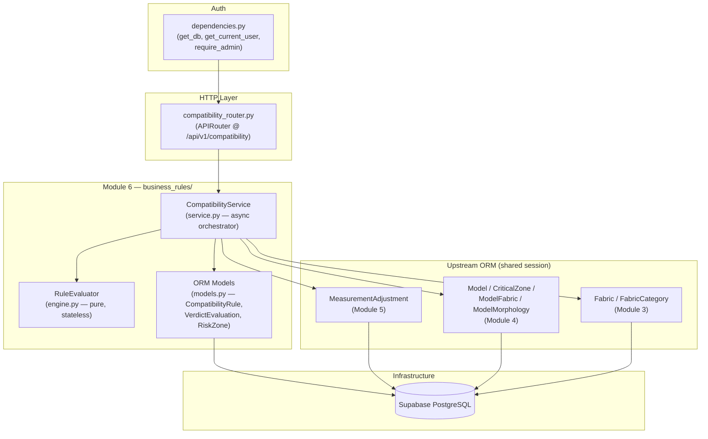
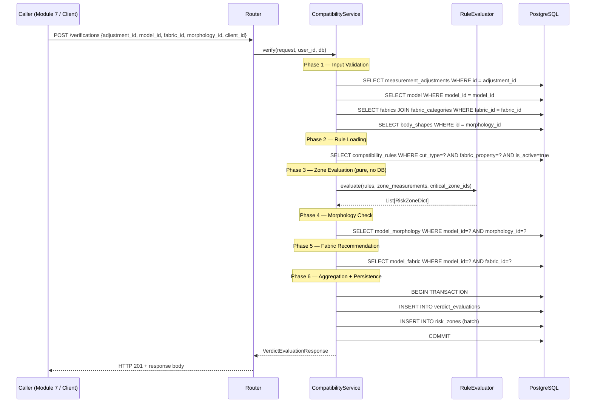

# Design Document: Module 6 — Fabric/Model/Silhouette Compatibility Engine

## Overview

Module 6 is the **Compatibility Verification Engine** of Lova Fashion. It determines
whether a combination of adjusted body measurements (from Module 5), a garment model
(Module 4), and a chosen fabric (Module 3) is manufacturable and wearable for a given
body morphology.

The engine applies administrator-configurable rules stored in the database — zone by zone,
independently — and aggregates the results into one of four global verdicts: **Compatible**,
**Compatible_with_Reservations**, **Incompatible**, or **Indeterminate**. Every evaluation
is persisted for audit. No hard-coded numeric threshold exists in application code.

The module lives in `backend/app/modules/business_rules/` alongside Module 5 (ease engine)
and Module 7, and follows the project's async FastAPI + SQLAlchemy ORM + Supabase
PostgreSQL conventions exactly.

---

## Architecture

### Component Diagram



### Verification Request Sequence



---

## File Structure

```
backend/app/modules/business_rules/
├── engine.py            # RuleEvaluator — pure, stateless (no DB access)
├── models.py            # SQLAlchemy ORM: CompatibilityRule, VerdictEvaluation, RiskZone
│                        # + ModelMorphology association table
├── schemas.py           # Pydantic v2 request/response schemas
├── service.py           # CompatibilityService — async orchestrator
├── router.py            # APIRouter — /api/v1/compatibility endpoints
├── dependencies.py      # get_db, get_current_user, require_admin
├── tests/
│   ├── conftest.py
│   ├── test_engine.py   # Unit + property-based tests for RuleEvaluator
│   ├── test_service.py  # Integration tests for CompatibilityService
│   └── __init__.py
└── __init__.py

backend/migrations/
└── 007_create_compatibility_tables.sql
```

> **Note:** Module 5 files (`engine.py`, `models.py`, `schemas.py`, `service.py`,
> `router.py`, `dependencies.py`) remain unchanged. Module 6 adds new classes
> and endpoints alongside them within the same package.

---

## Components and Interfaces

### 1. `RuleEvaluator` — `engine.py`

**Purpose**: Pure, stateless class that applies a list of active `CompatibilityRule`
records to a dict of zone measurements and returns a list of risk zone dicts. Zero
database access. Mirrors `EaseEngine` from Module 5.

**Interface**:

```python
@dataclass
class RuleInput:
    rules: list[RuleRecord]          # active rules for cut_type × fabric_property
    zone_measurements: dict[str, float]  # {"bust": 91.5, "waist": 70.0, "hips": 95.0}
    critical_zone_ids: list[uuid.UUID]   # zones associated with the model

@dataclass
class RuleRecord:
    rule_id: uuid.UUID
    zone_id: uuid.UUID | None
    zone_name: str                   # "bust" | "waist" | "hips"
    mathematical_condition: str      # e.g. "value > 96.0"
    severity_level: str              # "Incompatible" | "Reserve"
    explanation_message: str | None
    version: int

@dataclass
class RiskZoneDict:
    rule_id: uuid.UUID | None
    zone_id: uuid.UUID | None
    calculated_variance: float
    localized_verdict: str           # "Incompatible" | "Reserve"
    explanation: str
    rule_version: int
    warnings: list[str]              # malformed-condition warnings

class RuleEvaluator:
    def evaluate(self, inp: RuleInput) -> list[RiskZoneDict]:
        """
        Evaluates all zones independently. Returns one RiskZoneDict per
        satisfied rule condition. Never raises; malformed conditions are
        skipped with a warning appended to the returned item's warnings list.
        """
        ...
```

**Responsibilities**:
- Iterate over each `RuleRecord` and map `zone_name` → `zone_measurements` value
- Safely evaluate `mathematical_condition` (see §Safe Evaluation Strategy)
- Produce one `RiskZoneDict` per fired rule
- Skip zones with no matching measurement key (append to `missing_data_log` via return)
- Guarantee determinism: same inputs → identical outputs always

**Formal Specifications**:

*Preconditions*:
- `zone_measurements` values are floats ≥ 0.0
- `mathematical_condition` strings are ≤ 200 characters
- `rules` list may be empty (returns `[]`)

*Postconditions*:
- Returns a list (never `None`, never raises)
- Every returned item has `localized_verdict` in `{"Incompatible", "Reserve"}`
- If `rules` is empty, returns `[]`
- `calculated_variance` reflects the numeric value of the bound variable at evaluation time

### 2. `CompatibilityService` — `service.py`

**Purpose**: Async orchestrator. Fetches all upstream data, calls `RuleEvaluator`,
checks morphology and fabric links, aggregates the global verdict, and persists
`VerdictEvaluation` + `RiskZone` rows in a single transaction.

**Interface**:

```python
class CompatibilityService:
    @staticmethod
    async def verify(
        request: VerificationRequest,
        user_id: uuid.UUID,
        db: AsyncSession,
    ) -> VerdictEvaluationResponse: ...

    @staticmethod
    async def get_evaluation(
        evaluation_id: uuid.UUID,
        db: AsyncSession,
    ) -> VerdictEvaluationResponse: ...

    @staticmethod
    async def create_rule(
        body: CompatibilityRuleCreate,
        admin_id: uuid.UUID,
        db: AsyncSession,
    ) -> CompatibilityRuleResponse: ...

    @staticmethod
    async def update_rule(
        rule_id: uuid.UUID,
        body: CompatibilityRuleUpdate,
        db: AsyncSession,
    ) -> CompatibilityRuleResponse: ...

    @staticmethod
    async def list_rules(
        db: AsyncSession,
        limit: int = 200,
    ) -> list[CompatibilityRuleResponse]: ...
```

**Private helpers** (all async):
- `_load_adjustment_or_422(adjustment_id, db)` → `MeasurementAdjustment`
- `_load_model_or_422(model_id, db)` → `Model`
- `_load_fabric_or_422(fabric_id, db)` → `(Fabric, FabricCategory)`
- `_load_morphology_or_422(morphology_id, db)` → `BodyShape`
- `_load_active_rules(cut_type, fabric_property, db)` → `list[RuleRecord]`
- `_check_morphology_link(model_id, morphology_id, db)` → `str | None`
- `_check_fabric_link(model_id, fabric_id, db)` → `str | None`
- `_aggregate_verdict(risk_zones)` → `GlobalStatus`
- `_persist_evaluation(eval_data, risk_zones, db)` — single transaction

### 3. `compatibility_router.py` — `router.py` (new section)

Mounted at `/api/v1/compatibility` in `main.py`. All endpoints require JWT auth.
Admin endpoints additionally require `require_admin` dependency.

### 4. `dependencies.py` (additions)

Three new dependency functions added to the existing file:

```python
async def require_admin(
    current_user: uuid.UUID = Depends(get_current_user),
    credentials: HTTPAuthorizationCredentials = Depends(_bearer_scheme),
) -> uuid.UUID:
    """
    Decodes JWT, checks for is_admin=true claim.
    Raises HTTP 403 if claim is absent or false.
    """
    ...
```

---

## Data Models

### ORM Models (`models.py`)

All new classes inherit from `app.database.Base` (same shared Base as all other modules).

#### `CompatibilityRule`

```python
class CompatibilityRule(Base):
    __tablename__ = "compatibility_rules"
    __table_args__ = (
        UniqueConstraint("cut_type", "fabric_property", "zone_id", "is_active",
                         name="uq_rule_cut_fabric_zone_active"),
        CheckConstraint("severity_level IN ('Incompatible', 'Reserve')",
                        name="ck_rule_severity"),
        CheckConstraint("char_length(mathematical_condition) <= 200",
                        name="ck_rule_condition_length"),
        CheckConstraint("char_length(explanation_message) <= 500",
                        name="ck_rule_explanation_length"),
    )

    rule_id: uuid.UUID = Column(UUID(as_uuid=True), primary_key=True, default=uuid.uuid4)
    cut_type: str = Column(String(30), nullable=False)           # "Fitted" | "Semi-fitted" | "Loose"
    fabric_property: str = Column(String(30), nullable=False)    # "rigid" | "semi-stretch" | "stretch"
    zone_id: uuid.UUID | None = Column(UUID(as_uuid=True),
                                       ForeignKey("critical_zone.zone_id"), nullable=True)
    mathematical_condition: str = Column(String(200), nullable=False)
    severity_level: str = Column(String(20), nullable=False)
    explanation_message: str | None = Column(Text, nullable=True)
    is_active: bool = Column(Boolean, nullable=False, default=True)
    version: int = Column(Integer, nullable=False, default=1)
    admin_id: uuid.UUID = Column(UUID(as_uuid=True), nullable=False)  # logical FK to auth.users
    created_at: datetime = Column(DateTime(timezone=True), nullable=False, server_default=func.now())
    updated_at: datetime = Column(DateTime(timezone=True), nullable=False,
                                  server_default=func.now(), onupdate=func.now())
```

#### `VerdictEvaluation`

```python
class VerdictEvaluation(Base):
    __tablename__ = "verdict_evaluations"
    __table_args__ = (
        CheckConstraint(
            "global_status IN ('Compatible','Compatible_with_Reservations',"
            "'Incompatible','Indeterminate','Failed')",
            name="ck_evaluation_global_status"
        ),
    )

    evaluation_id: uuid.UUID = Column(UUID(as_uuid=True), primary_key=True, default=uuid.uuid4)
    created_at: datetime = Column(DateTime(timezone=True), nullable=False, server_default=func.now())
    global_status: str = Column(String(40), nullable=False)
    missing_data_log: str | None = Column(Text, nullable=True)
    fabric_recommendation: str | None = Column(String(50), nullable=True)
    client_id: uuid.UUID = Column(UUID(as_uuid=True), nullable=False)
    model_id: uuid.UUID = Column(UUID(as_uuid=True),
                                 ForeignKey("model.model_id"), nullable=False)
    fabric_id: uuid.UUID = Column(UUID(as_uuid=True), nullable=False)     # logical FK
    measurements_id: uuid.UUID = Column(UUID(as_uuid=True),
                                        ForeignKey("measurement_adjustments.id"), nullable=False)
    morphology_id: uuid.UUID = Column(UUID(as_uuid=True), nullable=False)  # logical FK

    risk_zones: list["RiskZone"] = relationship("RiskZone", back_populates="evaluation",
                                                cascade="all, delete-orphan", lazy="selectin")
```

#### `RiskZone`

```python
class RiskZone(Base):
    __tablename__ = "risk_zones"
    __table_args__ = (
        CheckConstraint("localized_verdict IN ('Incompatible', 'Reserve')",
                        name="ck_risk_zone_verdict"),
    )

    risk_id: uuid.UUID = Column(UUID(as_uuid=True), primary_key=True, default=uuid.uuid4)
    evaluation_id: uuid.UUID = Column(UUID(as_uuid=True),
                                      ForeignKey("verdict_evaluations.evaluation_id",
                                                 ondelete="CASCADE"), nullable=False)
    rule_id: uuid.UUID | None = Column(UUID(as_uuid=True),
                                       ForeignKey("compatibility_rules.rule_id"), nullable=True)
    zone_id: uuid.UUID | None = Column(UUID(as_uuid=True),
                                       ForeignKey("critical_zone.zone_id"), nullable=True)
    calculated_variance: float = Column(Numeric(8, 4), nullable=False)
    localized_verdict: str = Column(String(20), nullable=False)
    explanation: str = Column(Text, nullable=False)
    rule_version: int = Column(Integer, nullable=False)

    evaluation: "VerdictEvaluation" = relationship("VerdictEvaluation",
                                                   back_populates="risk_zones")
```

#### `ModelMorphology` (new association table — Module 6 migration)

```python
class ModelMorphology(Base):
    __tablename__ = "model_morphology"
    __table_args__ = (
        CheckConstraint("suitability_score IN ('Ideal', 'Flattering', 'Avoid')",
                        name="ck_morphology_score"),
    )

    model_id: uuid.UUID = Column(UUID(as_uuid=True),
                                 ForeignKey("model.model_id", ondelete="CASCADE"),
                                 primary_key=True)
    morphology_id: uuid.UUID = Column(UUID(as_uuid=True), primary_key=True)  # logical FK
    suitability_score: str = Column(String(15), nullable=False)
```

---

## Pydantic Schemas (`schemas.py`)

```python
# ── Requests ─────────────────────────────────────────────────────────────────

class VerificationRequest(BaseModel):
    adjustment_id: UUID
    model_id: UUID
    fabric_id: UUID
    morphology_id: UUID
    client_id: UUID

class CompatibilityRuleCreate(BaseModel):
    cut_type: str
    fabric_property: str
    zone_id: UUID | None = None
    mathematical_condition: str = Field(..., max_length=200)
    severity_level: Literal["Incompatible", "Reserve"]
    explanation_message: str | None = Field(None, max_length=500)
    is_active: bool = True

class CompatibilityRuleUpdate(BaseModel):
    mathematical_condition: str | None = Field(None, max_length=200)
    severity_level: Literal["Incompatible", "Reserve"] | None = None
    explanation_message: str | None = Field(None, max_length=500)
    is_active: bool | None = None

# ── Responses ─────────────────────────────────────────────────────────────────

class RiskZoneResponse(BaseModel):
    risk_id: UUID
    rule_id: UUID | None
    zone_id: UUID | None
    calculated_variance: float
    localized_verdict: Literal["Incompatible", "Reserve"]
    explanation: str
    rule_version: int
    model_config = {"from_attributes": True}

class VerdictEvaluationResponse(BaseModel):
    evaluation_id: UUID
    global_status: Literal[
        "Compatible", "Compatible_with_Reservations",
        "Incompatible", "Indeterminate", "Failed"
    ]
    created_at: datetime
    fabric_recommendation: str | None
    risk_zones: list[RiskZoneResponse]
    model_config = {"from_attributes": True}

class CompatibilityRuleResponse(BaseModel):
    rule_id: UUID
    cut_type: str
    fabric_property: str
    zone_id: UUID | None
    mathematical_condition: str
    severity_level: str
    explanation_message: str | None
    is_active: bool
    version: int
    created_at: datetime
    model_config = {"from_attributes": True}
```

---

## API Endpoint Table

| Method | Path | Auth | Description | Success | Errors |
|--------|------|------|-------------|---------|--------|
| `POST` | `/api/v1/compatibility/verifications` | JWT user | Run a full compatibility check | 201 | 422, 503, 500 |
| `GET` | `/api/v1/compatibility/verifications/{evaluation_id}` | JWT user | Retrieve a persisted evaluation + risk zones | 200 | 404, 500 |
| `POST` | `/api/v1/compatibility/compatibility-rules` | JWT admin | Create a new compatibility rule | 201 | 409, 422, 403 |
| `PATCH` | `/api/v1/compatibility/compatibility-rules/{rule_id}` | JWT admin | Update mutable fields; increments version | 200 | 404, 422, 403 |
| `GET` | `/api/v1/compatibility/compatibility-rules` | JWT admin | List all rules (active + inactive), max 200 | 200 | 403 |

**Router prefix** registered in `main.py`:
```python
app.include_router(
    compatibility_router,
    prefix="/api/v1/compatibility",
    tags=["compatibility"],
)
```

---

## `mathematical_condition` Safe Evaluation Strategy

`mathematical_condition` is a short string expression (≤ 200 chars) stored in the DB by
admins, evaluated server-side against a single bound variable. **Raw `eval()` is
forbidden.**

### Approach: `simpleeval` library

```python
from simpleeval import SimpleEval, EvalWithCompoundTypes, NameNotDefined

def _safe_eval_condition(condition: str, value: float) -> bool:
    """
    Evaluate a mathematical_condition string against a single numeric variable.

    The only allowed variable name is 'value' (the adjusted measurement in cm).

    Examples of valid conditions:
        "value > 96.0"
        "value / 1.05 > 90"
        "value <= 110.0"

    Returns
    -------
    bool — True if the condition is satisfied (rule fires).

    Raises
    ------
    ValueError — condition is syntactically malformed or references
                 undefined names. Caller (RuleEvaluator) must catch this.
    """
    evaluator = SimpleEval()
    evaluator.names = {"value": value}
    evaluator.operators = {}   # only arithmetic + comparisons, no function calls
    return bool(evaluator.eval(condition))
```

**Why `simpleeval`**:
- Parses a strict subset of Python expressions (arithmetic, comparisons, logical `and`/`or`)
- No import of builtins, no attribute access, no function calls
- Returns a typed result; `bool()` coercion makes the contract explicit
- `NameNotDefined` raised on any variable not in `evaluator.names`

**Fallback if `simpleeval` unavailable**: Use `ast.parse(condition, mode='eval')` with a
custom `NodeVisitor` that whitelists only `ast.Compare`, `ast.BinOp`, `ast.UnaryOp`,
`ast.Constant`, and `ast.Name` nodes — rejecting all others before evaluation.

**Variable binding convention**:

| `mathematical_condition` variable | Bound to |
|-----------------------------------|----------|
| `value` | `zone_measurements[zone_name]` (adjusted cm for the zone) |

Admins write conditions like `value > 96.0` or `value / ratio > 1.05`. The `zone_name`
is known from the rule's `zone_id` → `CriticalZone.zone_name`.

**Rule skip on error**: If `_safe_eval_condition` raises for a given rule, `RuleEvaluator`
appends a warning `{"rule_id": ..., "message": "Condition invalide: <condition>"}` to its
return value and continues evaluating remaining rules without halting.

---

## Core Algorithm: `RuleEvaluator.evaluate()`

```pascal
ALGORITHM RuleEvaluator.evaluate(inp: RuleInput)
INPUT:
    inp.rules               — list of active RuleRecord objects
    inp.zone_measurements   — dict mapping zone_name (str) → adjusted_cm (float)
    inp.critical_zone_ids   — list of UUID for zones associated with the model
OUTPUT:
    risk_zones: list of RiskZoneDict
    eval_warnings: list of str

BEGIN
    risk_zones ← []
    eval_warnings ← []

    IF inp.rules = [] THEN
        RETURN risk_zones, eval_warnings
    END IF

    FOR EACH rule IN inp.rules DO
        zone_name ← lookup(rule.zone_id → critical_zone.zone_name)

        IF zone_name NOT IN inp.zone_measurements THEN
            eval_warnings.append("Zone inconnue: " + str(rule.zone_id))
            CONTINUE
        END IF

        value ← inp.zone_measurements[zone_name]

        TRY
            fired ← _safe_eval_condition(rule.mathematical_condition, value)
        CATCH ValueError AS e
            eval_warnings.append("Condition invalide [rule=" + str(rule.rule_id) + "]: " + str(e))
            CONTINUE
        END TRY

        IF fired THEN
            explanation ← rule.explanation_message
            IF explanation IS NULL OR explanation = "" THEN
                explanation ← _build_default_explanation(zone_name, rule.cut_type, rule.fabric_property, rule.rule_id)
            END IF

            risk_zones.append(RiskZoneDict(
                rule_id=rule.rule_id,
                zone_id=rule.zone_id,
                calculated_variance=value,
                localized_verdict=rule.severity_level,
                explanation=explanation,
                rule_version=rule.version,
                warnings=[]
            ))
        END IF
    END FOR

    RETURN risk_zones, eval_warnings
END
```

**Loop invariant**: At every iteration, `risk_zones` contains only `RiskZoneDict`
entries with `localized_verdict ∈ {"Incompatible", "Reserve"}` and non-empty
`explanation` strings.

---

## Global Verdict Aggregation Algorithm

```pascal
ALGORITHM _aggregate_verdict(risk_zones: list[RiskZoneDict]) → GlobalStatus

BEGIN
    IF any rz IN risk_zones WHERE rz.localized_verdict = "Incompatible" THEN
        RETURN "Incompatible"
    ELSE IF any rz IN risk_zones WHERE rz.localized_verdict = "Reserve" THEN
        RETURN "Compatible_with_Reservations"
    ELSE
        RETURN "Compatible"
    END IF
END
```

**Priority rule**: `Incompatible` > `Reserve` > `Compatible`. This mirrors the
requirements: a single hard-block zone overrides any number of soft reservations.

---

## Rule Version Deduplication

When loading active rules for a `(cut_type, fabric_property)` combination, the service
selects only the rows with the **highest `version`** number per `(cut_type, fabric_property, zone_id)` group:

```python
# Raw SQL via text() — consistent with Module 5 cross-module query pattern
sql = text("""
    SELECT cr.*
    FROM compatibility_rules cr
    INNER JOIN (
        SELECT zone_id, MAX(version) AS max_version
        FROM compatibility_rules
        WHERE cut_type = :cut_type
          AND fabric_property = :fabric_property
          AND is_active = true
        GROUP BY zone_id
    ) latest ON cr.zone_id = latest.zone_id
           AND cr.version = latest.max_version
    WHERE cr.cut_type = :cut_type
      AND cr.fabric_property = :fabric_property
      AND cr.is_active = true
""")
```

This guarantees that stale rule versions are never applied to new evaluations, while
previously persisted `RiskZone` rows retain their `rule_version` snapshot for audit.

---

## Persistence — Single Transaction Pattern

```python
async def _persist_evaluation(
    eval_data: dict,
    risk_zones: list[RiskZoneDict],
    db: AsyncSession,
) -> VerdictEvaluation:
    """
    Persist VerdictEvaluation + all RiskZone rows in one transaction.
    Rolls back entirely on any failure (Req 7.7, 7.8).
    """
    async with db.begin():
        evaluation = VerdictEvaluation(**eval_data)
        db.add(evaluation)
        await db.flush()   # get evaluation_id for FK references

        for rz in risk_zones:
            db.add(RiskZone(
                evaluation_id=evaluation.evaluation_id,
                **rz,
            ))

        # transaction commits on context-manager exit
    return evaluation
```

**UUID collision guard**: If the `INSERT` raises `IntegrityError` on `evaluation_id`,
the service retries once with a newly generated `uuid.uuid4()` before returning HTTP 500.

---

## Indeterminate Handling

When rule loading returns an empty list, `CompatibilityService.verify()` short-circuits:

```pascal
IF active_rules = [] THEN
    log.error(
        "Indeterminate evaluation — no rule found",
        extra={"cut_type": cut_type, "fabric_property": fabric_property,
               "model_id": model_id, "fabric_id": fabric_id}
    )
    persist VerdictEvaluation(
        global_status="Indeterminate",
        missing_data_log=f"Aucune règle active pour cut_type={cut_type}, fabric_property={fabric_property}",
        risk_zones=[]
    )
    RETURN HTTP 201 + VerdictEvaluationResponse(global_status="Indeterminate", risk_zones=[])
END IF
```

The `ERROR`-level structured log entry is the alert mechanism for admins
(email/push notification is out of scope per Assumption 10).

---

## Error Handling Matrix

| Condition | HTTP Status | `global_status` persisted | `missing_data_log` |
|-----------|-------------|---------------------------|---------------------|
| Missing `adjustment_id` / `model_id` / `fabric_id` / `morphology_id` | 422 | *(not persisted)* | — |
| `adjustment_id` not found | 422 | *(not persisted)* | — |
| Adjusted measurement ≤ 0 or > 300 cm | 422 | *(not persisted)* | — |
| Model `status ≠ Published` | 422 | *(not persisted)* | — |
| Fabric `fabric_status ≠ available` | 422 | *(not persisted)* | — |
| `morphology_id` not found | 422 | *(not persisted)* | — |
| Upstream module unreachable (after 2 retries) | 503 | *(not persisted)* | — |
| No active rule for cut/fabric combo | 201 | `Indeterminate` | unmatched cut_type + fabric_property |
| Rule DB query technical error | 500 | `Failed` | DB error description |
| Morphology link DB error | 500 | `Failed` | DB error description |
| Invariant violation (Incompatible but no RiskZone) | 500 | `Failed` | invariant violation description |
| Persistence transaction failure | 500 | *(rolled back)* | — |
| All checks pass, no risk zones | 201 | `Compatible` | null |
| Reserve zones only | 201 | `Compatible_with_Reservations` | null |
| Any Incompatible zone | 201 | `Incompatible` | null |

**Admin-only endpoint errors:**

| Condition | HTTP Status |
|-----------|-------------|
| Non-admin JWT calling admin endpoint | 403 |
| `POST` with duplicate `(cut_type, fabric_property, zone_id)` active rule | 409 |
| `PATCH` with `rule_id` not found | 404 |
| `PATCH` attempting to change `cut_type`, `fabric_property`, or `zone_id` | 422 |

---

## Migration Strategy — `007_create_compatibility_tables.sql`

```sql
-- Migration 007 — Create Module 6 compatibility tables
-- Module 6 — Fabric/Model/Silhouette Compatibility Engine

-- 1. compatibility_rules — admin-configured thresholds
CREATE TABLE compatibility_rules (
    rule_id               UUID          PRIMARY KEY DEFAULT gen_random_uuid(),
    cut_type              VARCHAR(30)   NOT NULL,
    fabric_property       VARCHAR(30)   NOT NULL,
    zone_id               UUID          REFERENCES critical_zone(zone_id),
    mathematical_condition VARCHAR(200)  NOT NULL,
    severity_level        VARCHAR(20)   NOT NULL
                          CHECK (severity_level IN ('Incompatible', 'Reserve')),
    explanation_message   TEXT
                          CHECK (char_length(explanation_message) <= 500),
    is_active             BOOLEAN       NOT NULL DEFAULT TRUE,
    version               INTEGER       NOT NULL DEFAULT 1,
    admin_id              UUID          NOT NULL,   -- logical FK to auth.users
    created_at            TIMESTAMPTZ   NOT NULL DEFAULT now(),
    updated_at            TIMESTAMPTZ   NOT NULL DEFAULT now()
);

COMMENT ON TABLE compatibility_rules IS
    'Admin-configurable rule set. No hard-coded thresholds in application code.';

CREATE INDEX idx_rules_cut_fabric_active
    ON compatibility_rules (cut_type, fabric_property, is_active);

-- 2. model_morphology — body-shape suitability link (MODEL_MORPHOLOGY_LINK)
CREATE TABLE model_morphology (
    model_id        UUID  NOT NULL REFERENCES model(model_id) ON DELETE CASCADE,
    morphology_id   UUID  NOT NULL,   -- logical FK to body_shapes
    suitability_score VARCHAR(15) NOT NULL
                    CHECK (suitability_score IN ('Ideal', 'Flattering', 'Avoid')),
    PRIMARY KEY (model_id, morphology_id)
);

COMMENT ON TABLE model_morphology IS
    'Suitability of a garment model for a given body morphology (MODULE_MORPHOLOGY_LINK).';

-- 3. verdict_evaluations — persisted evaluation records
CREATE TABLE verdict_evaluations (
    evaluation_id       UUID        PRIMARY KEY DEFAULT gen_random_uuid(),
    created_at          TIMESTAMPTZ NOT NULL DEFAULT now(),
    global_status       VARCHAR(40) NOT NULL
                        CHECK (global_status IN (
                            'Compatible','Compatible_with_Reservations',
                            'Incompatible','Indeterminate','Failed')),
    missing_data_log    TEXT,
    fabric_recommendation VARCHAR(50),
    client_id           UUID        NOT NULL,
    model_id            UUID        NOT NULL REFERENCES model(model_id),
    fabric_id           UUID        NOT NULL,   -- logical FK to fabrics
    measurements_id     UUID        NOT NULL
                        REFERENCES measurement_adjustments(id),
    morphology_id       UUID        NOT NULL    -- logical FK to body_shapes
);

COMMENT ON TABLE verdict_evaluations IS
    'Immutable audit record of each compatibility check. Never updated after creation.';

CREATE INDEX idx_verdict_client ON verdict_evaluations (client_id, created_at DESC);

-- 4. risk_zones — per-zone violation records
CREATE TABLE risk_zones (
    risk_id             UUID        PRIMARY KEY DEFAULT gen_random_uuid(),
    evaluation_id       UUID        NOT NULL
                        REFERENCES verdict_evaluations(evaluation_id) ON DELETE CASCADE,
    rule_id             UUID        REFERENCES compatibility_rules(rule_id),
    zone_id             UUID        REFERENCES critical_zone(zone_id),
    calculated_variance NUMERIC(8,4) NOT NULL,
    localized_verdict   VARCHAR(20) NOT NULL
                        CHECK (localized_verdict IN ('Incompatible', 'Reserve')),
    explanation         TEXT        NOT NULL,
    rule_version        INTEGER     NOT NULL
);

COMMENT ON TABLE risk_zones IS
    'One row per fired rule per evaluation. rule_version snapshots the rule state at evaluation time.';

-- Auto-update trigger for compatibility_rules.updated_at
CREATE TRIGGER trg_compatibility_rules_updated_at
    BEFORE UPDATE ON compatibility_rules
    FOR EACH ROW EXECUTE FUNCTION set_updated_at();

-- RLS: verdict_evaluations — users see only their own evaluations
ALTER TABLE verdict_evaluations ENABLE ROW LEVEL SECURITY;

CREATE POLICY verdict_select_owner ON verdict_evaluations
    FOR SELECT USING (client_id = auth.uid());

CREATE POLICY verdict_insert_service ON verdict_evaluations
    FOR INSERT WITH CHECK (true);   -- service role only; JWT clients can only SELECT

-- RLS: risk_zones — accessible via parent evaluation ownership
ALTER TABLE risk_zones ENABLE ROW LEVEL SECURITY;

CREATE POLICY risk_zone_select_owner ON risk_zones
    FOR SELECT USING (
        evaluation_id IN (
            SELECT evaluation_id FROM verdict_evaluations WHERE client_id = auth.uid()
        )
    );
```

---

## Testing Strategy

### Unit Tests — `test_engine.py`

`RuleEvaluator` is fully testable without a database, following the same pattern as
`test_engine.py` for `EaseEngine`.

**Deterministic test cases:**

| Test ID | Description | Assertion |
|---------|-------------|-----------|
| RE-01 | Empty rules list → empty risk zones | `evaluate([]) == []` |
| RE-02 | Single matching rule → one RiskZoneDict | `len(result) == 1` |
| RE-03 | Rule does not fire → empty list | `result == []` |
| RE-04 | Two rules fire for different zones → two entries | `len(result) == 2` |
| RE-05 | `severity_level="Incompatible"` → `localized_verdict="Incompatible"` | field check |
| RE-06 | `severity_level="Reserve"` → `localized_verdict="Reserve"` | field check |
| RE-07 | `explanation_message=None` → default fallback string used | non-empty string |
| RE-08 | Malformed `mathematical_condition` → rule skipped, warning appended | no exception |
| RE-09 | Unknown `zone_name` not in `zone_measurements` → skipped, warning | no exception |
| RE-10 | `rule_version` copied correctly to output | `result[0].rule_version == rule.version` |

### Property-Based Tests — Hypothesis

```python
from hypothesis import given, settings, strategies as st
from hypothesis import HealthCheck

# Strategy: arbitrary float measurements in valid range
zone_measurement_st = st.fixed_dictionaries({
    "bust":  st.floats(min_value=0.0, max_value=300.0, allow_nan=False),
    "waist": st.floats(min_value=0.0, max_value=300.0, allow_nan=False),
    "hips":  st.floats(min_value=0.0, max_value=300.0, allow_nan=False),
})

# Strategy: syntactically valid conditions
valid_condition_st = st.sampled_from([
    "value > 90.0",
    "value <= 110.0",
    "value / 1.05 > 85.0",
    "value >= 50.0 and value <= 120.0",
])

severity_st = st.sampled_from(["Incompatible", "Reserve"])

@given(zone_measurements=zone_measurement_st, severity=severity_st)
def test_p1_determinism(zone_measurements, severity):
    """Same inputs always produce identical Risk_Zone lists (Req 3.9, Req 8.3)."""
    rule = _make_rule(condition="value > 50.0", severity=severity)
    inp = RuleInput(rules=[rule], zone_measurements=zone_measurements,
                    critical_zone_ids=[rule.zone_id])
    evaluator = RuleEvaluator()
    result_1 = evaluator.evaluate(inp)
    result_2 = evaluator.evaluate(inp)
    assert result_1 == result_2

@given(zone_measurements=zone_measurement_st)
def test_p2_verdict_values_constrained(zone_measurements):
    """All localized_verdict values are in {Incompatible, Reserve} (Req 3.4, 3.5)."""
    rules = [_make_rule("value > 0.0", "Incompatible"),
             _make_rule("value >= 0.0", "Reserve")]
    inp = RuleInput(rules=rules, zone_measurements=zone_measurements,
                    critical_zone_ids=[r.zone_id for r in rules])
    result = RuleEvaluator().evaluate(inp)
    for rz in result:
        assert rz.localized_verdict in ("Incompatible", "Reserve")

@given(zone_measurements=zone_measurement_st)
def test_p3_empty_rules_returns_empty(zone_measurements):
    """Empty rule list always returns empty output (Req 8.1)."""
    inp = RuleInput(rules=[], zone_measurements=zone_measurements, critical_zone_ids=[])
    assert RuleEvaluator().evaluate(inp) == []

@given(zone_measurements=zone_measurement_st, severity=severity_st)
def test_p4_explanation_never_empty_on_fired_rule(zone_measurements, severity):
    """Every fired rule produces a non-empty explanation (Req 6.3)."""
    rule = _make_rule(condition="value >= 0.0", severity=severity,
                      explanation_message=None)
    inp = RuleInput(rules=[rule], zone_measurements=zone_measurements,
                    critical_zone_ids=[rule.zone_id])
    result = RuleEvaluator().evaluate(inp)
    for rz in result:
        assert rz.explanation is not None
        assert len(rz.explanation.strip()) > 0

@given(
    zone_measurements=zone_measurement_st,
    condition=st.text(min_size=1, max_size=200),
)
def test_p5_malformed_condition_never_raises(zone_measurements, condition):
    """Arbitrary condition strings never cause unhandled exceptions (Req 8.4)."""
    rule = _make_rule(condition=condition, severity="Reserve")
    inp = RuleInput(rules=[rule], zone_measurements=zone_measurements,
                    critical_zone_ids=[rule.zone_id])
    try:
        RuleEvaluator().evaluate(inp)   # must not raise
    except Exception as e:
        pytest.fail(f"evaluate() raised {type(e).__name__}: {e}")
```

### Integration Tests — `test_service.py`

- Test `CompatibilityService.verify()` against an in-memory async SQLite session
- Cover: happy path Compatible, Compatible_with_Reservations, Incompatible,
  Indeterminate, `Failed` (DB error mock), fabric link present/absent, morphology
  `Avoid` triggering Reserve zone
- Verify single-transaction rollback when `INSERT risk_zones` fails mid-way

---

## Correctness Properties

The following properties are verifiable by the test suite and must hold for all inputs:

1. **Determinism** — `∀ inputs: evaluate(inputs) = evaluate(inputs)`. Identical inputs
   always produce identical `RiskZoneDict` lists with identical `calculated_variance`
   and `localized_verdict` values. (Req 3.9)

2. **Verdict closure** — `∀ rz ∈ evaluate(…): rz.localized_verdict ∈ {"Incompatible", "Reserve"}`.
   No other verdict value is ever produced at the zone level. (Req 3.4, 3.5)

3. **Explanation completeness** — `∀ rz ∈ evaluate(…): len(rz.explanation.strip()) > 0`.
   Every risk zone has a non-empty explanation string; the fallback builder guarantees
   this even when `explanation_message` is null. (Req 6.3)

4. **Global verdict monotonicity** — If `global_status = "Incompatible"` then
   `∃ rz ∈ risk_zones: rz.localized_verdict = "Incompatible"`. The engine never reports
   Incompatible without at least one corresponding risk zone. (Req 5.3)

5. **Isolation** — `RuleEvaluator.evaluate()` performs zero database reads or writes
   for any input. (Req 8.2)

6. **No partial persistence** — A `VerdictEvaluation` and its `RiskZone` rows are
   either both committed or both rolled back. The database never contains an orphaned
   `RiskZone` with no parent `VerdictEvaluation`. (Req 7.7)

7. **Immutability of past evaluations** — Updating a `CompatibilityRule` does not modify
   any existing `VerdictEvaluation` or `RiskZone` row. `rule_version` in `RiskZone`
   reflects the rule state at evaluation time. (Req 7.4, 7.2)

8. **Malformed condition safety** — `∀ condition ∈ String(200): evaluate()` never raises
   an unhandled exception; malformed conditions are skipped with a warning. (Req 8.4)

---

## Dependencies

| Dependency | Purpose | New? |
|------------|---------|------|
| `fastapi` | HTTP framework | Existing |
| `sqlalchemy[asyncio]` | Async ORM | Existing |
| `asyncpg` | PostgreSQL async driver | Existing |
| `pydantic` v2 | Request/response validation | Existing |
| `python-jose` | JWT decode for auth | Existing |
| `simpleeval` | Safe expression evaluation for `mathematical_condition` | **New** |
| `hypothesis` | Property-based testing | Existing |
| `pytest`, `pytest-asyncio` | Test runner | Existing |

Add to `backend/requirements.txt`:
```
simpleeval==0.9.13
```

---

## Security Considerations

- **Admin endpoints** (`POST/PATCH/GET /compatibility-rules`) are protected by a
  `require_admin` dependency that checks the `is_admin` claim in the JWT payload. A
  missing or false claim returns HTTP 403; no rule content is leaked in the response body.
- **Safe expression evaluation** prevents code injection via `mathematical_condition`.
  `simpleeval` restricts the evaluation to arithmetic and comparison operators with no
  access to builtins, imports, or attribute traversal.
- **RLS policies** on `verdict_evaluations` and `risk_zones` ensure users can only
  read their own evaluation records via Supabase direct access.
- **No upstream data mutation**: Module 6 is read-only with respect to Modules 3, 4,
  and 5 tables; it never updates `fabrics`, `model`, or `measurement_adjustments`.

## Performance Considerations

- Rule loading uses a single indexed SQL query (index on `cut_type, fabric_property,
  is_active`). Typical rule sets are small (< 50 rows per cut/fabric pair).
- `RuleEvaluator.evaluate()` is O(n × m) where n = rules and m = zones. Both are
  bounded constants in practice (< 10 zones, < 100 rules per combo).
- Batch-insert for `RiskZone` rows avoids N+1 writes; all inserts run in one `db.flush()`
  within the single transaction.
- The `GET /verifications/{evaluation_id}` endpoint uses `lazy="selectin"` on the
  `risk_zones` relationship — one query for the evaluation, one for all its risk zones.
